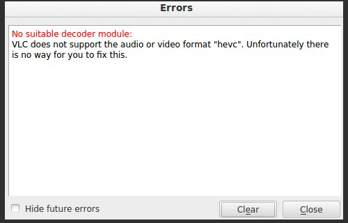

So you finally got yourself an awesome movie or some other video that you've been longing to watch, however the problem is your laptop/ desktop cannot play it. You try switching between the different video players you have but none plays it....in fact you try the "all powerful" VLC player and it not only fails it actually says "Unfortunately there is no way to fix this!!!" 

 
Well, before giving up on your attempts to watch your video, open your terminal and run the below commands.

|| sudo apt-add-repository ppa:strukturag/libde265 ||

|| sudo apt-get update ||

|| sudo apt-get install vlc-plugin-libde265    ||

Then reboot your pc and launch you vlc and enjoy your video.
